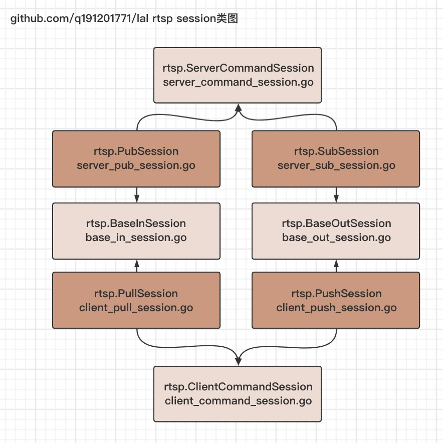

# Session pub/sub/push/pull of connection types

**Streaming media transmission** usually refers to the continuous transmission of streaming audio and video data over a network.  
A network channel for transmitting data consists of two ends, and we define the two ends in the following cases.

### Connection establishment direction perspective, ClientSession, ServerSession

From the perspective of connection establishment direction, there are two types of connections: **active initiating side** and **passive processing side**.

For example, over TCP connection:

- The one that calls connect and connects to the other side is called the active initiator.
- The call to accept and process the connection is called the passive processing side.

Often, we will refer to the active initiator as the client.

- The active initiator is called the client.
- The passive processor is called the server.

Note that this division of client and server is a specific division of meaning. "Client" does not just mean a programme running on the C side of a PC, app, web, etc., but also a *service* on a server, for example, service A connects to service B on another server.

From the connection establishment direction point of view, the active initiating side is called **client session** and the passive processing side is called **server session**:

```
             connect       accept
+-----------------+         +-----------------+
|  ClientSession  |  ---->  |  ServerSession  |
+-----------------+         +-----------------+
```

### Audio and video data sending direction axis, (AVData)InSession, OutSession

In addition to the connection establishment direction axis, another axis is the audio/video data sending direction:

- Data sender, i.e. (AVData)OutSession
- The data sender, i.e. (AVData)OutSession, is the data receiver, i.e. (AVData)InSession.

Note that all the data mentioned here does not refers to (raw) audio and video data. Instead, it refers to the signalling data such as handshake, publish, subscribe, etc. in the business layer protocol after the connection is established.

Since the direction of connection establishment and the direction of data sending may be the same or opposite, they are further divided into 4 roles:

### PushSession, PullSession, PubSession, SubSession

A connects to B and A sends data to B:

```
A | --connect--> | B
  | --av data--> |
```

In the case above:

- A is a `ClientSession` + `OutSession`, which we call `PushSession`.
- B is a `ServerSession` + `InSession`, which we call `PubSession`.

In the other case, A connects to B and B sends data to A:

```
A | --connect--> | B
  | <--av data-- |
```

The above case:

- A belongs to `ClientSession` + `InSession`, which we call `PullSession`.
- B belongs to `ServerSession` + `OutSession`, which we call `SubSession`.

**Note that Pub/Sub is an acronym for Publish/Subscribe**.

**Note that the definitions of Push, Pull, Pub, and Sub are my personal definitions, and there is no industry standard. It is just a consensus in lal and related projects and documents.**

> Related discussion on naming: https://github.com/q191201771/lal/issues/243

### Why do we need to standardise the nomenclature?

There are two advantages:

First, it makes communications easier.

Let's consider a streaming module that supports RTMP push streams and RTSP pull streams. So does it mean that someone pushes a RTMP stream to it, and then another person pulls a RTSP stream from it; or does it take the initiative to pull RTSP stream from someone else, and then convert the stream to RTMP format and push it out?  
With our nomenclature, the first case corresponds to `rtmp pub + rtsp sub`, and the second case corresponds to `rtsp pull -> rtmp push`.

Now, with the protocol support table in ["Introduction to lalserver"](LALServer.md), you can get a pretty clear idea of what protocols lalserver supports, and which ones can be converted.  
On the [Demo listings page](DEMO.md), from the name of each of the demo applications, you can clearly figure out its role.

Second, it makes it easy to organise and reuse code.

Take the RTSP protocol as an example:

1. pub and sub as the server side, most of the signalling part of the processing is the same, similarly, push and pull as the client side is also the same.
2. In addition, most of the logic is the same for pub and pull as the inbound audio/video streams, and similarly for sub and push as the outbound streams.



yoko, 20210206

---

Being original is not easy. Reproduction is allowed, but please reference this article as being part of the documentation for the open-source streaming media server [lal](https://github.com/q191201771/lal) (GitHub link).   Official documentation: [https://pengrl.com/lal](https://pengrl.com/lal)